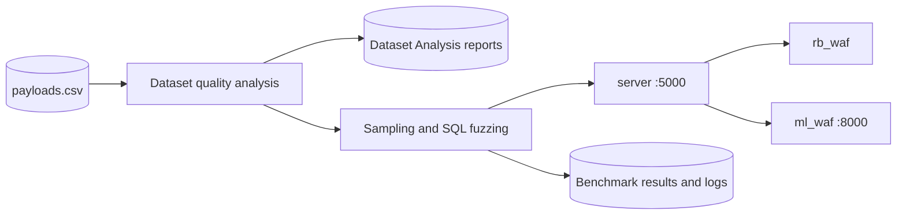

# TEE-WAFs-Framework

Docker-based research framework for analyzing payload datasets and comparing a
rule-based WAF with an ML-based WAF under original and fuzzed traffic.

## Overview

The framework provides a reproducible workflow with two connected stages:

1. Assess the internal quality of the input dataset before an experiment.
2. Send sampled and fuzzed payloads through both WAFs and compare their decisions.

The dataset stage checks completeness, label consistency, redundancy, balance,
entropy, and available attack-family coverage. The benchmark stage records whether
the rule-based and ML-based WAFs classified each request correctly.

## Research Context

Machine-learning WAF performance may be influenced by dataset and evaluation bias.
A model can appear effective when its dataset contains duplicates, contradictory
labels, limited attack families, unrealistic class distributions, or leakage
between training and evaluation data.

This project supports experiments across three related dimensions:

- Dataset diversity and internal quality
- Training validity
- Evaluation robustness under fuzzed inputs

WAF-Brain is used as the ML-WAF case study, while a ModSecurity/Apache container
provides the rule-based comparison.

## Components

- `client`: analyzes the dataset, samples payloads, generates fuzzed variants,
  sends requests, and records benchmark results
- `server`: accepts client requests and coordinates both WAF decisions
- `ml_waf`: WAF-Brain-based ML service
- `rb_waf`: ModSecurity/Apache rule-based WAF

## Architecture and Workflow



Execution order:

1. The client reads `payloads.csv` and validates its schema.
2. If enabled, it analyzes the complete dataset and prints a quality report.
3. It saves detailed JSON and CSV analysis artifacts.
4. It randomly selects the configured number of original payloads.
5. It sends each original payload and its generated fuzzed variants to the server.
6. The server obtains decisions from `rb_waf` and `ml_waf`.
7. The client writes individual outcomes, confusion counts, and a combined matrix.
8. Docker Compose stops the stack after the client finishes when run with the
   recommended command below.

## Prerequisites

- Docker Desktop, including Docker Compose
- Git
- Optional: Python 3.9+ for local development

Verify Docker before starting:

```powershell
docker --version
docker compose version
```

## Quick Start

Clone the repository:

```powershell
git clone https://github.com/imhamzasajjad/TEE-WAFs-Framework
cd TEE-WAFs-Framework
```

Build and run the complete experiment:

```powershell
docker compose up --build --abort-on-container-exit --exit-code-from client
```

The client first prints the dataset report, then sends the configured original and
fuzzed payloads. After the final combined result, Compose stops the remaining
services and returns the client's exit code.

For subsequent runs that do not contain source changes:

```powershell
docker compose up --abort-on-container-exit --exit-code-from client
```

Stop and remove the stack manually if required:

```powershell
docker compose down
```

## Client Configuration

Client settings are defined under `services.client.environment` in
[`docker-compose.yml`](docker-compose.yml):

```yaml
services:
  client:
    environment:
      - ANALYZE_DATASET=yes
      - NUM_SAMPLES=1
      - NUM_FUZZING_ROUNDS=1
```

| Variable | Purpose |
|---|---|
| `ANALYZE_DATASET` | `yes` runs analysis; `no` skips it during repeated experiments. |
| `NUM_SAMPLES` | Number of original rows randomly selected from the dataset. |
| `NUM_FUZZING_ROUNDS` | Number of fuzzed variants generated per selected row. |
| `PAYLOADS_FILE` | Input path inside the client container; defaults to `payloads.csv`. |
| `DATASET_ANALYSIS_DIR` | Report directory; defaults to `Dataset Analysis`. |

Enabled values for `ANALYZE_DATASET` are `yes`, `true`, `on`, and `1`, ignoring
case. Other values disable analysis. When disabled, payload testing runs normally
and existing analysis reports remain unchanged.

## Dataset Quality Analysis

### Input format

The default input is [`client/payloads.csv`](client/payloads.csv). It must contain
a payload column and a label or HTTP-status column:

```csv
payload,status code
"normal search query",200
"' OR 1=1 --",403
```

The analyzer recognizes common alternatives including `request`, `text`, `input`,
`query`, `label`, `class`, and `target`. If an `attack category`, `attack type`,
`category`, or `family` column exists, attack-family coverage is also reported.

### What is measured

| Dimension | Measurements | Why it matters |
|---|---|---|
| Integrity | Valid rows, missing payloads/labels, conflicting labels | Broken or contradictory records weaken training and evaluation. |
| Payload diversity | Canonical uniqueness and character vocabulary | Indicates whether the input contains varied payloads. |
| Redundancy | Exact and normalized duplicates | Repetition can inflate results and overrepresent patterns. |
| Label balance | Counts and normalized Shannon entropy | Imbalance can bias a classifier toward the majority class. |
| Payload complexity | Per-payload character entropy and length statistics | Describes internal payload structure and variation. |
| File structure | Whole-file and 256-byte chunk entropy | Exposes repetitive or compositionally different file regions. |
| Attack coverage | Category counts when metadata is available | Shows which attack families are represented. |

Canonical comparison URL-decodes payloads, converts them to lowercase, collapses
whitespace, and trims surrounding whitespace. This catches records that differ in
formatting but represent the same normalized payload.

Whole-file and chunk entropy are diagnostic evidence, not direct score inputs. CSV
formatting, encoding, row order, repeated labels, compression, and random noise can
change byte entropy without making the dataset more useful.

### Score and verdict

The internal quality score combines four components:

- Integrity: 30%
- Payload diversity: 30%
- Low redundancy: 20%
- Label balance: 20%

| Score | Verdict | Interpretation |
|---:|---|---|
| 80-100 | Suitable | Strong internal structure for an experiment. |
| 60-79.99 | Usable with caution | Review warnings before using the dataset. |
| 40-59.99 | High risk | Important quality problems may affect results. |
| 0-39.99 | Unsuitable | Correct the dataset before testing. |

Critical conditions—including an empty or very small dataset or excessive label
conflicts—cap the verdict at `Unsuitable`. The thresholds are transparent research
defaults and may need calibration for another domain.

The verdict describes **internal dataset quality**. It is not proof that a dataset:

- Represents real production traffic
- Covers every attack family
- Is free from collection or source bias
- Has no train/test leakage
- Is suitable for every ML-WAF architecture

Leakage analysis requires split membership or separate training and test files.
Semantic coverage requires category metadata or a trusted reference dataset.

### Console output

When enabled, analysis is printed before any payload is sent:

```text
================================================================
DATASET ANALYSIS
================================================================
Verdict                  : Suitable
Overall score            : 99.32/100
Total / valid rows       : 19275 / 19275
Label distribution       : 200: 7953, 403: 11322
Exact duplicate rows     : 76
Canonical duplicate rows : 94
Conflicting labels       : 2
Mean character entropy   : 3.2497 bits
Whole-file byte entropy  : 4.5277 bits/byte
Chunk entropy mean/range : 4.1147 (3.0968-5.0178) bits/byte
Attack categories        : unavailable (no category column)
================================================================
```

### Generated reports

The client creates `client/Dataset Analysis/` automatically. Its Compose volume
keeps these files on the host:

- `dataset_analysis.json`: complete machine-readable evidence, verdict, critical
  findings, thresholds, and limitations
- `dataset_analysis.csv`: compact table of scored quality components
- `chunk_entropy.csv`: entropy measurement for each 256-byte file region

Generated report files are intentionally ignored by Git because each run can
replace them. The directory itself is retained in the repository.

The current payload data originates from the
[HTTP Params Dataset](https://www.kaggle.com/datasets/evg3n1j/httpparamsdataset).

## Benchmark Results

For every original and fuzzed payload, the client records:

- Expected/original status
- Rule-based WAF status
- ML-WAF status
- Whether each WAF was correct
- Whether both systems agreed or disagreed

It also calculates TP, TN, FP, and FN totals and prints a combined 2x2 comparison:

```text
Combined Results (2x2 Matrix):
               WAF Correct    WAF Incorrect
ML Correct     2              0
ML Incorrect   0              0
```

## Output Locations

- `client/Dataset Analysis/`: dataset score, evidence, and chunk entropy
- `client/logs/`: request-level client results and aggregate metrics
- `client/Results/`: stored experiment results
- `server/logs/`: server-side request decisions
- `rb_waf/logs/`: rule-based WAF logs, when available

## Testing the Analyzer

The analyzer uses the Python standard library and has focused unit tests:

```powershell
cd client
python -m unittest discover -s tests -v
```

## Troubleshooting

If updated client functionality does not appear, rebuild only the client image:

```powershell
docker compose down
docker compose build --no-cache client
docker compose up --abort-on-container-exit --exit-code-from client
```

Inspect individual service logs:

```powershell
docker compose logs client
docker compose logs server
docker compose logs ml_waf
docker compose logs rb_waf
```

If ports are busy, check local services using ports `5000` and `8000`. Ensure Docker
Desktop has sufficient CPU and memory if builds or services stop unexpectedly.

## Additional Documentation

- ML module: [`ml_waf/README.rst`](ml_waf/README.rst)
- ML contribution guide: [`ml_waf/CONTRIBUTING.md`](ml_waf/CONTRIBUTING.md)
